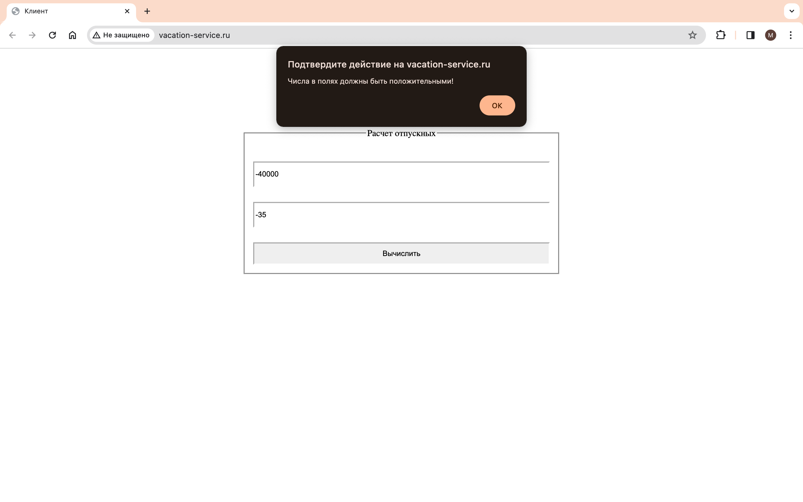
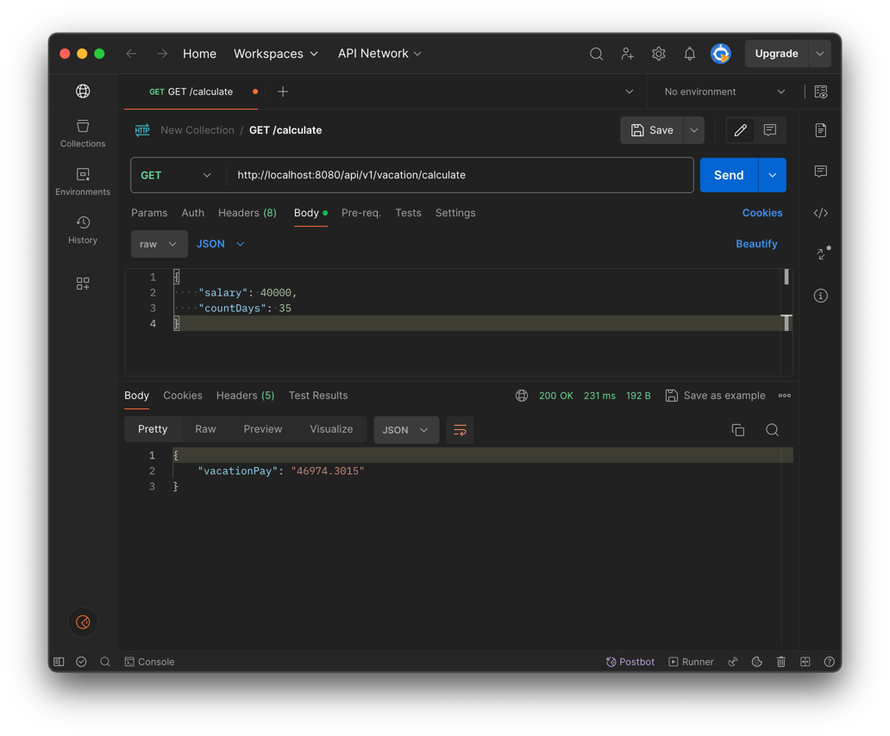
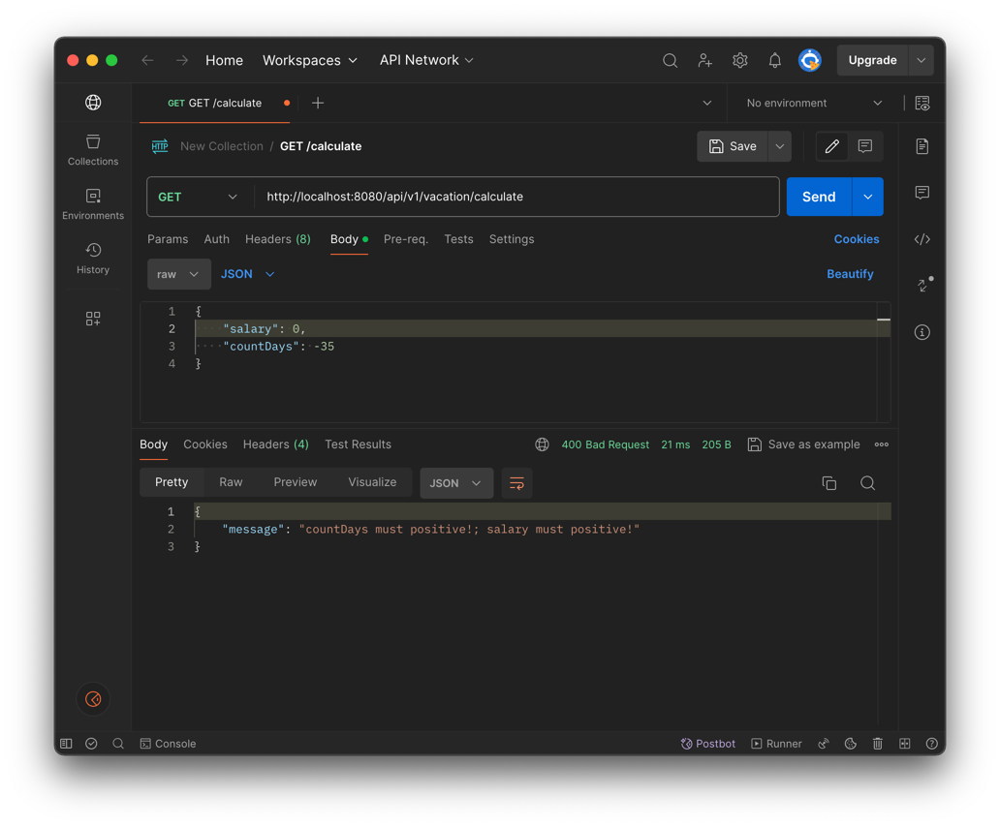

# Приложение "Калькулятор отпускных"
Развернуто на Raspberry Pi 4, состоит из [клиента](https://github.com/MunSunch/VacationPayServiceClient) и бекэнда, описанного в данном документе.
Итоговое приложение доступно по адресу:
http://vacation-service.ru

## Требования
Приложение принимает твою среднюю зарплату за 12 месяцев и количество дней отпуска - отвечает суммой отпускных, которые придут сотруднику.

Микросервис на SpringBoot + Java 11 c одним API: GET "/calculate"

Доп. задание: При запросе также можно указать точные дни ухода в отпуск, тогда должен проводиться рассчет отпускных с учётом праздников и выходных.

## Особенности реализации
Реализован единственный эндпоинт GET /api/v1/vacation/calculate для получения отпускных, который требует
указания заголовков salary(средняя зарплата) и countDays(количество дней отпуска).

Алгоритм расчета приведен в соответствие с минимальными требованиями и реализован в [SimplePayProvider](src/main/java/com/munsun/vacation_service/services/impl/providers/impl/SimplePayProvider.java).
Такая реализация допускает масштабирование в случае изменения алгоритма расчета за счет применения шаблона
проектирования 'стратегия'.

Методы контроллеров логируются в [VacationPayControllerAspect](src/main/java/com/munsun/vacation_service/aspects/VacationPayControllerAspect.java),
ошибки обрабатываются в [VacationPayControllerAdvice](src/main/java/com/munsun/vacation_service/advices/VacationPayControllerAdvice.java).

Написаны модульные тесты, однако только для проверки правильности расчетов.

Вся документация по API приведена в [api-docs](api-docs.yaml).

## Запуск
Подготовка: установить [Maven](https://maven.apache.org/download.cgi) 
и в зависимости от способа запуска [Docker](https://www.docker.com/products/docker-desktop/) 
или [Java](https://www.oracle.com/java/technologies/downloads/).

Перейти в корень и собрать проект из терминала:

```
mvn clean package -DskipTests=true
```

Для запуска jar-архива:

```
java -jar target/VacationPayService.jar
```

Для запуска docker-образа:

```
docker compose up
```
## Примеры запуска
Расчет


Ошибка валидации


## Примеры запуска без клиента
Расчет


Ошибка валидации
